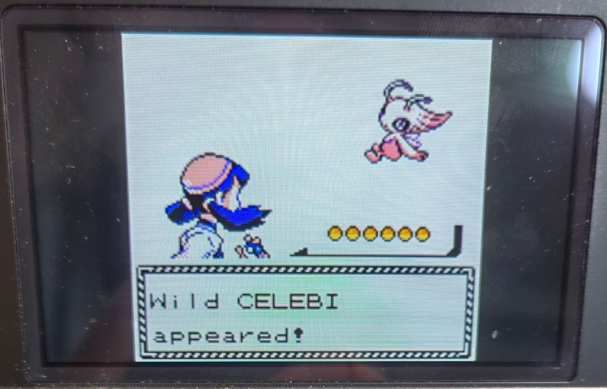
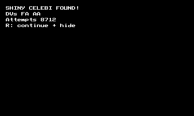
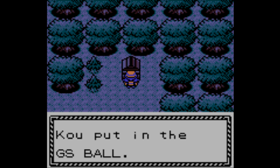

# CelebiHunter

面向在 Luma3DS 实机上游玩英文版 3DS Virtual Console《Pokémon Crystal Version》、希望获得闪光时拉比的玩家。CelebiHunter 提供全自动循环刷闪和玩家手动操作的 RNG 两种版本。

[English](README.md)

<p align="center">
  
</p>

> [!IMPORTANT]
> Pokémon Bank 将于 [**2027 年 2 月 26 日**](https://en-americas-support.nintendo.com/app/answers/detail/a_id/61543/~/pok%C3%A9mon-bank-service-update)结束服务，届时从 Bank 传送至 Pokémon HOME 的功能也会停止。
>
> 在目前仍能把宝可梦传入 HOME 的系列正作中，[3DS VC《Pokémon Crystal Version》的 GS Ball 遭遇](https://www.pokemon.com/us/strategy/wrangle-rare-pokemon-in-pokemon-crystal)是唯一能让玩家自行捕捉闪光时拉比，并保留自己 OT、第二世代 Trainer ID 和 Game Boy 来源标志的途径。CelebiHunter 用于在这条传送路线关闭前完成这次捕捉。

## 版本

**Reset**

想按原版的 `1/8192` 概率刷闪，只是不想一直重复按键，就选 Reset。插件会自动跑完整套流程，但不保证多少轮能出闪。

**RNG**

只想尽快拿到闪光时拉比，就选 RNG。所有按键仍由玩家自己操作，插件会在时拉比生成时把 DVs 固定为 `FAAA`。这不是传统的手动刷闪。

**一次只安装一个版本。**

## 兼容范围

- 英文版 3DS VC《Pokémon Crystal Version》
- Title ID：`0004000000172800`
- Ilex Forest Shrine（桐树林神龛）GS Ball 时拉比事件
- 已启用 Plugin Loader 的 Luma3DS
- Old 3DS、Old 2DS、New 3DS、New 2DS
- 268 MHz、804 MHz

主要测试环境：New 3DS、268 MHz、Luma3DS 13.4。欢迎使用其他机型、CPU 模式或 Luma3DS 版本的玩家通过 GitHub Issues 反馈实机测试结果。

日版 Crystal 和其他宝可梦遭遇**暂未支持**，后续会考虑扩展。

## 安装

1. 在 Ilex Forest Shrine（桐树林神龛）正前方，面向神龛并在放入 GS Ball 前保存游戏。
2. 退出游戏，用 Checkpoint 备份存档，并在电脑上保留一份原始副本。
3. 从最新 GitHub Release 下载 `Reset.3gx` 或 `RNG.3gx`。
4. 把选中的文件放入：

   ```text
   sd:/luma/plugins/0004000000172800/
   ```

5. 确认该目录内只有一个 `.3gx` 文件。
6. 按 `L + 十字键下 + Select` 打开 Rosalina，启用 **Plugin Loader**。
7. 启动 Pokémon Crystal。

## Reset

启动游戏后不要操作。Reset 会自动进入 Continue（继续游戏）、触发神龛并检查时拉比。

<p align="center">
  
</p>

- **非闪：**自动开始下一轮。
- **闪光：**停止并保留当前遭遇。
- `B`：停止自动流程。
- `R`：遇到闪光或按 `B` 停止后，恢复游戏并隐藏结果卡片。

## RNG

RNG 没有操作界面，安装后照常游玩即可。

<p align="center">
  
</p>

1. 手动来到神龛并推进对话。
2. 当 `[PLAYER] put in the GS BALL.` 完整显示时，松开 A。
3. 再正常按一次 A，继续事件。
4. 时拉比将以 `FAAA` 闪光 DVs 生成。

### 传送到后续作品后

- `FAAA` 代表攻击 15、防御 10、速度 10、特殊 10，HP DV 为 8，是第二世代的一种闪光组合。
- 这些 DV 不会直接带到后续作品。
- Poké Transporter 会给时拉比**五项 31**，剩下一项随机。
- 第二世代没有性格。刚捕获且没有获得过经验的等级 30 时拉比会是 **Timid（胆小）**；传送前练过级则可能不同。
- 自己的 **OT 和第二世代 Trainer ID** 会保留，Secret ID 变为 `00000`。
- 球种是普通 Poké Ball（精灵球），特性是 Natural Cure（自然回复），并带有 **Game Boy 来源标志**。
- 从 Bank 传到 HOME 时不会改变这些内容。

完整转换规则：[Poké Transporter](https://bulbapedia.bulbagarden.net/wiki/Pok%C3%A9_Transporter#From_Generation_I_and_II)

## 文档

- [编译](docs/BUILDING.md)
- [备份与恢复](docs/SAFETY.md)
- [开发计划](docs/ROADMAP.md)
- [参与开发](CONTRIBUTING.md)

## 许可

CelebiHunter 采用 [GNU GPL v3.0 or later](LICENSE)。致谢见 [CREDITS.md](CREDITS.md)。
